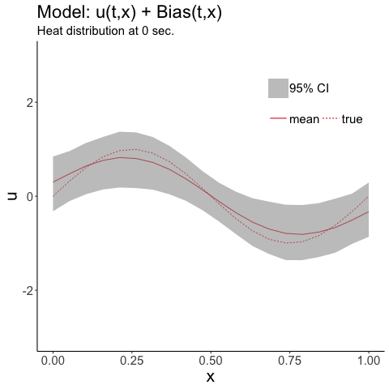

# Bayesian Calibration of Imperfect Computer Models using Physics-Informed Priors

This repository is the official implementation of the paper "Bayesian Calibration of Imperfect Computer Models using Physics-Informed Priors". 

<p align="center">
  
  
</p>

<p align="center">
Time evolution of heat distribution with biased sensor data using physics-informed priors. 
</p>

## Requirements
The results can be reproduced in R (version 4.0.3).

To install required packages:

```setup
install.packages("rstan") 
install.packages("ggplot2")
install.packages("reshape2")
install.packages("ggpubr")
install.packages("lhs")
```
---
## Notebooks to reproduce the results
The notebooks (.Rmd files) contain the code to reproduce the results in the paper.

More specifically:

- The **WK_FB_analysis__S3.2.Rmd** contains the code of the results in Section 3.2.
- The **WK_MD__S3.3.Rmd** contains the code of the results in Section 3.3.
- The **HF__S4.Rmd** contains the code of the results in Section 4.
- The **Real_data_WK__S5.Rmd** contains the code of the results in Section 5.

All notebooks have also been exported as .pdf and .html files. 

Running time ranges from several minutes up to ~20 minutes.

---
## STAN folder
The **STAN** folder contains the stan code for the models in Sections 3, 4 and 5.

More specifically:

- The **Windkessel** folder contains the stan code for the models in Section 3 and 5.
- The **Heat_equation** folder contains the stan code for the models in Section 4.

## Data folder
The **Data** folder contains blood flow data used to simulate blood pressures in Section 3 and the real data used in Section 5. 

- **Inflow_time.rds** is the blood flow and time data used in the simulation study of Section 4. 
- **Real_data.rds** is real data used in Section 5.

## figures folder
The **figures** folder contains all paper figures. These figures can be reproduced in the notebooks.

## functions folder
The **WK2and3_sim_fn.R** file contains the WK2 and WK3 numerical simulator sused to simulate data for the experiments in Section 4. The **WK_exp_fn.R** file ccontains functions to extract the posterior distributions from the stan models.

## Intsructions for building new models using the existing stan code
The existing stan codes can be used for building physics-informed GP models by doing the following:

- replace the mean and covariance function with your model's corresponing functions
- define priors for the physical and noise parameters
